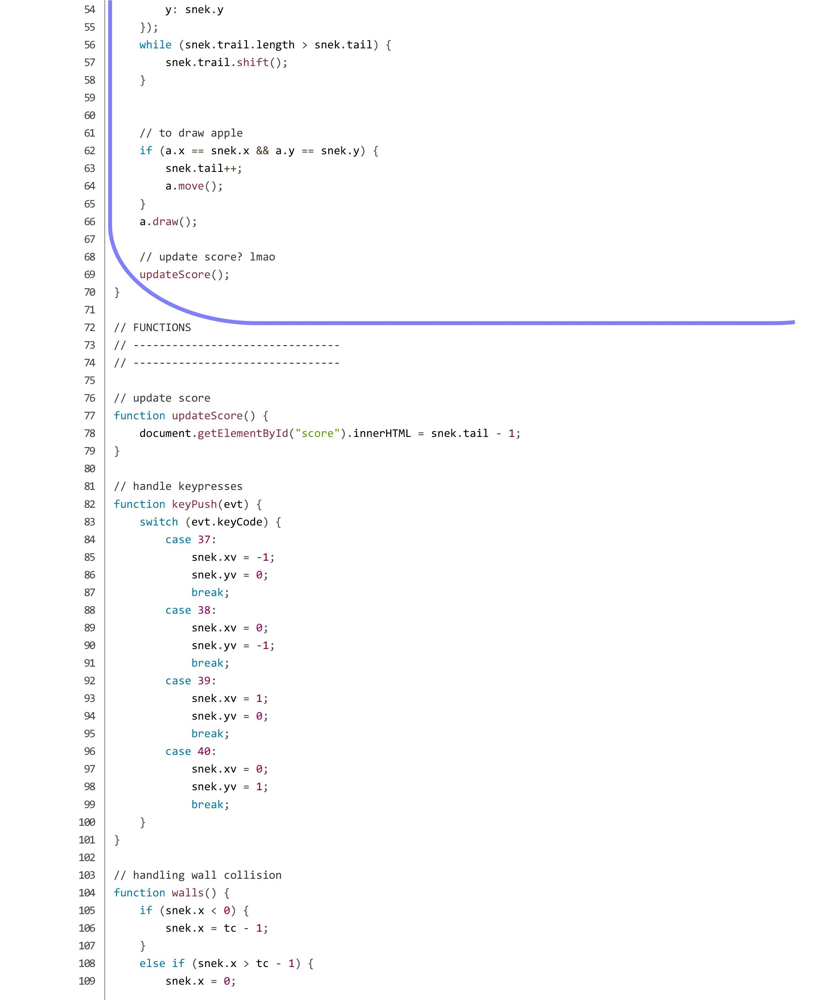
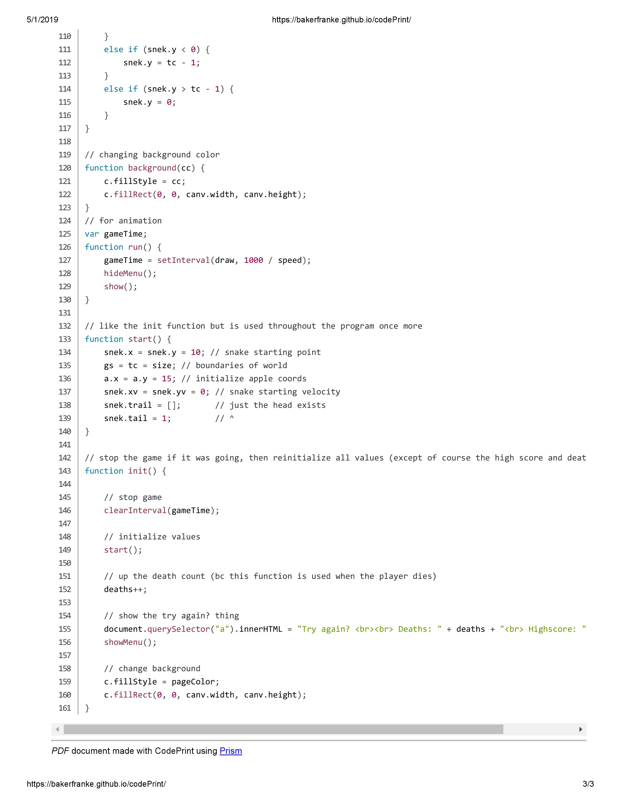

# Purpose  

The player controls a dot or box inside of a physically looping universe in which the object is to acquire the dot of another color, in turn, gaining points. In the event that a point is gained, a trail is made behind the "head" (anterior end) of the player. In the case that a player runs into itself, by either making a complete 180 and snapping its neck, or turning multiple times to run into the trail, the game restarts and the player's trail is reset.  
  

# Development Process  

### First Difficulty
The first difficulty in the program was making the player not instantly die (because the head and tail are on the same coordinates). The player's head was counted as a part of its tail when the length was one and therefore died because it's touching itself. How I resolved this problem was adding a counter which was the score, it was one less than the length. This ultimately resolved all problems with the head being part of the trail.

### Second Difficulty
The second difficulty of this program was making the environment reset after death. The problem was that I couldn't hide some elements and eventually had to rewrite the entirety of the reset function and instead of hiding elements, it drew over it.

# Main Algorithm
 

### How does it function?
The main algorithm uses a velocity variable and keystrokes to move the player object around the screen.

### How does it relate to the overall purpose?
It allows the user to be able to actually play the game, as it is what shows the player, the background, and the desirable scoring object.

### Sub-Algorithm 1 (Moving The Player)
The player is moved using a switch case detecting keystrokes. There is a built-in function inside of the player constructor, to deal with keystrokes, called on every frame (12 per second). If the key-code is 37, change the player’s velocity to left. If it is 38 change the velocity to up. If it is 39 change the velocity to right. Finally, if the key code is 40 change the velocity to down.

### Sub-Algorithm 2 (Manipulating the Player’s Trail)
The trail created by gaining a point is moved in accordance to the head. The trail is stored in an array along with the specific coordinates of any part of the tail at any given time. Once the player moves, the entire array is shifted to the right, and if a point is gained, the trail length grows.

# Abstraction

### Code
    function Player() {
	    this.tail = 1;
	    this.trail = [];
	    this.xv;
	    this.yv;
	    this.x;
	    this.y;
	    this.moveLeft = function() {
	        this.xv = -1;
	        this.yv = 0;
	    };
	    this.moveRight = function() {
	        this.xv = 1;
	        this.yv = 0;
	    };
	    this.moveUp = function() {
	        this.xv = 0;
	        this.yv = -1;
	    };
	    this.moveDown = function() {
	        this.xv = 0;
	        this.yv = 1;
	    };
	}

### Managing Complexity
This abstraction manages complexity by making it so that instead of manipulating many global variables and then losing track of what does what, it makes it all in one object/constructor. This constructor function has even more functions inside of it to handle movement of the player.

### Cleanliness
The main code would be very dirty and ugly without this abstraction. There would be loose variables all over the place, that would confuse readers of the code and possibly drive them away. Instead of changing the p.xy and p.yv all the time, this cuts it down to one line, effectively making the code 50% cleaner in those specific spots. The functions inside have intuitive names that are easy to call and understand.

# The Code
The code was separated into different files. Each file will be named with a heading.
### sketch.js (the main code)

### index.html

	<html>
	    <head>
	        <!-- the title of the page -->
	        <title>Worm</title>
        
	        <!-- styling -->
	        <link rel="stylesheet" href="css/box.css">
	        <link rel="stylesheet" href="css/main.css">
	        <link href="css/p1.css" rel="stylesheet">
        
        
	        <!-- the scripts to run the page -->
	        
	        
	        
	        
        
        
	        <!-- favicon (it's royalty free shut up) -->
	        <link rel="shortcut icon" href="icons/snake.png"/>
        
	    </head>
	    <body>

        <!-- THE MAIN GAME -->
        <!-- ----------------------------- -->
        

        

            

                    
                    
 SCORE: 

                    
0

                    
                    <canvas id="canvas" width="400" height="400" style="padding: 10px"></canvas> <!-- to draw everything on-->
                    
                
                
            

            <!-- THE BUTTONS -->
            <!-- ----------------------------- -->

            

                <a onclick="run();" class = "box"class="menu">Click to Start</a>
            

	        

	    

	    </body>
	</html>

### main.css

    body {
			font-family: 'Press Start 2P', cursive;
			background-color: #dcdde1;
		}
		canvas {
				border: solid 4px black;
		}
		#score {
				color: #74b9ff;
		}
		#game {
				text-align: center;
				position: absolute;
				left: 50%;
				/*
				margin-left: -200px;
				*/
				margin-left: -15%;
				z-index: 1;
				box-shadow: 0 2px 3px 0px rgba(0,0,0,0.25);
				padding: 30px;
		}
		.menu {
				z-index: 2;
				position: absolute;
				text-align: center;
				color: #7f8fa6;
				transition: all .2s ease-in-out;
		}
		.menu:hover {
				transform: scale(1.3); /* make it a little bigger hovering over it */
		}
		#click {
				display: none;
		}
### p1.css
	/* cyrillic-ext */
	@font-face {
		font-family: 'Press Start 2P';
		font-style: normal;
		font-weight: 400;
		src: local('Press Start 2P Regular'), local('PressStart2P-Regular'), url(https://fonts.gstatic.com/s/pressstart2p/v7/e3t4euO8T-267oIAQAu6jDQyK3nYivNm4I81PZQ.woff2) format('woff2');
		unicode-range: U+0460-052F, U+1C80-1C88, U+20B4, U+2DE0-2DFF, U+A640-A69F, U+FE2E-FE2F;
	}
	/* cyrillic */
	@font-face {
		font-family: 'Press Start 2P';
		font-style: normal;
		font-weight: 400;
		src: local('Press Start 2P Regular'), local('PressStart2P-Regular'), url(https://fonts.gstatic.com/s/pressstart2p/v7/e3t4euO8T-267oIAQAu6jDQyK3nRivNm4I81PZQ.woff2) format('woff2');
		unicode-range: U+0400-045F, U+0490-0491, U+04B0-04B1, U+2116;
	}
	/* greek */
	@font-face {
		font-family: 'Press Start 2P';
		font-style: normal;
		font-weight: 400;
		src: local('Press Start 2P Regular'), local('PressStart2P-Regular'), url(https://fonts.gstatic.com/s/pressstart2p/v7/e3t4euO8T-267oIAQAu6jDQyK3nWivNm4I81PZQ.woff2) format('woff2');
		unicode-range: U+0370-03FF;
	}
	/* latin-ext */
	@font-face {
		font-family: 'Press Start 2P';
		font-style: normal;
		font-weight: 400;
		src: local('Press Start 2P Regular'), local('PressStart2P-Regular'), url(https://fonts.gstatic.com/s/pressstart2p/v7/e3t4euO8T-267oIAQAu6jDQyK3nbivNm4I81PZQ.woff2) format('woff2');
		unicode-range: U+0100-024F, U+0259, U+1E00-1EFF, U+2020, U+20A0-20AB, U+20AD-20CF, U+2113, U+2C60-2C7F, U+A720-A7FF;
	}
	/* latin */
	@font-face {
		font-family: 'Press Start 2P';
		font-style: normal;
		font-weight: 400;
		src: local('Press Start 2P Regular'), local('PressStart2P-Regular'), url(https://fonts.gstatic.com/s/pressstart2p/v7/e3t4euO8T-267oIAQAu6jDQyK3nVivNm4I81.woff2) format('woff2');
		unicode-range: U+0000-00FF, U+0131, U+0152-0153, U+02BB-02BC, U+02C6, U+02DA, U+02DC, U+2000-206F, U+2074, U+20AC, U+2122, U+2191, U+2193, U+2212, U+2215, U+FEFF, U+FFFD;
	}
### box.css
	.box{
		padding:30px;
		margin:2%;
		background:white;
		border:1px solid #d6d6d6;
		box-shadow:0 2px 3px 0px rgba(0,0,0,0.25);
		border-radius:3px;
		transition:.2s all;
		filter:blur(3px);
		opacity:.5;
		transform: scale(.98);
		/* margin-left: 42.8%; */
		margin-left: -4%;
		text-align: center;
		margin-top: 9%;
		position: absolute;
		z-index: 2;
	}
	.box:hover{
		transform:scale(1);
		filter:blur(0px);
		opacity:1;
		box-shadow:0 8px 20px 0px rgba(0,0,0,0.125);
	}
	.gameContainer {
			margin-top: 5%;
			margin-left: -16%;
	}
### player.js
	function Player() {
			// variables to use in game, no actual functions ig bc im lazy and can do it without them here
			// could use class, but lmao heck classes
			this.tail = 1;
			this.trail = [];
			this.xv;
			this.yv;
			this.x;
			this.y;
			this.moveLeft = function() {
					this.xv = -1;
					this.yv = 0;
			};
			this.moveRight = function() {
					this.xv = 1;
					this.yv = 0;
			};
			this.moveUp = function() {
					this.xv = 0;
					this.yv = -1;
			};
			this.moveDown = function() {
					this.xv = 0;
					this.yv = 1;
			};
	}
### css.js
	// to show the canvas
	function show() {
			canvas.style.display = "inline";
			// eval(element + ".style.display='inline'");
	}

	// to hide the canvas
	function hide() {
			canvas.style.display = "none";
			// eval(element + ".style.display='none'");
	}

	// to hide the button
	function hideMenu() {
			document.getElementById("start").style.display = 'none';
	}

	// to show the button
	function showMenu() {
			document.getElementById("start").style.display = 'inline';
	}
### apple.js
	// not using classes bc classes r stupid ahaha 420 gucci gang
	function Apple() {
			this.x, this.y;
			this.move = function() {
					a.x = Math.floor(Math.random() * tc);
					a.y = Math.floor(Math.random() * tc);
			};
			this.draw = function() {
					c.fillStyle = appleColor;
					c.fillRect(a.x * gs, a.y * gs, gs - 2, gs - 2);
			};
	}
